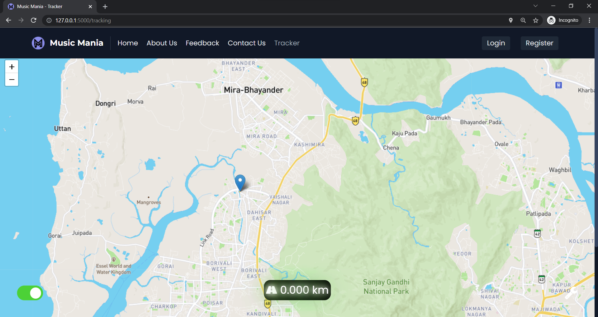

# Music Mania

### TEAM NAME : <Dcode>
## 👨‍💻Contributors
* Ananya Bangera - agbangera_b20@ce.vjti.ac.in
* Akash Sable - acsable_b20@it.vjti.ac.in
* Pratham Loya - prloya_b20@it.vjti.ac.in
* Pramod Dhaygude- pcdhaygude_b20@it.vjti.ac.in

 ## 👨‍🏫Mentors
* Rakesh Rajpurohit
* Devayani Shivankar 

## 📝Description
Music Mania is a specially designed web page which assists music player featured with distance measuring system.Music mania is highly prefered to those who loves to listen songs during  jogging ,walking. users also have provided with the instant distance tracker inbuilt in it.
iterface of the player is user friendly so anyone can easly get ,what they need.As the signup is must, the  data provide by user also be secure
* Songs are fetch by using SPOTIFY API 
* There are all options too like(recent played song , playlist,collection ) in it 

## 🔗Links
* GitHub repo link: [(https://github.com/ananya-bangera/Music_Mania.git)]
* Drive link: [https://drive.google.com/drive/u/0/folders/1nnR9YUIvYQy22t1vNMwIb-wKFngH_Jl0]
* Website link: [Website link here] 

## Technology stack

## Project Setup

- [x] Frontend Work
- [x] Distance Tracker Api
- [x] backend code of (Sign-up,login ,register) 
- [ ] Spotify API( working.....)
- [ ] some part of responsive design 

## Usage
>To open webpage ,we need to run python file named as (run.py)
>Then to use link provided in output to open webpage(ctrl+l-click)

## Applications
>As each and every person  wants things to happen faster ,and  dont want to waste valuable time
>in such situation our Music Mania is time saver for those users for dowloading different application for tracker or to calculate calories burned

## 🔮Future Scope
>for making it more  flexible  ,we are planning to add below fetures in future 
* calorie burn counter
* To give access of  setting a fix distance(planed distance)
* history of disance covered (in graph format )

## Screenshots
 
<b>Home Page UI</b>
  
<table>
  <tr>
    <td><b> Home Page Search section </b></td>
     <td><b> Top Artists </b></td>
  </tr>
  <tr>
    <td></td>
    <td></td>
  </tr>
 </table>
  

 
<b></b>
  
<table>
  <tr>
    <td><b> About Us UI </b></td>
     <td><b>FeedBack UI </b></td>
  </tr>
  <tr>
    <td></td>
    <td></td>
  </tr>
 </table>
  

 
<b></b>
  
<table>
  <tr>
     <td><b> Tracker UI </b></td>
  </tr>
  <tr>
    <td></td>

  </tr>
 </table>
  
  
<b> User Credentials</b>
  
<table>
  <tr>
    <td><b> Register Page UI </b></td>
     <td><b> Login Page UI </b></td>
  </tr>
  <tr>
    <td></td>
    <td></td>

  </tr>
 </table>
  
  
<b>User Credentials</b>
  
<table>
  <tr>
    <td><b> Reset Password UI </b></td>
     <td><b> Email </b></td>
     <td><b> Change Password  UI </b></td>
  </tr>
  <tr>
    <td></td>
    <td></td>
    <td></td>
  </tr>
 </table>
  
   
<b></b>
  
<table>
  <tr>
    <td><b> Albums UI </b></td>
   <td><b> Media Player UI </b></td>
  </tr>
  <tr>
    <td></td>
    <td></td>
  </tr>
 </table>
  
 
